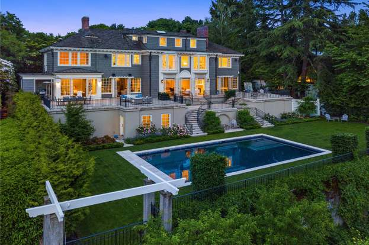

```{r setup, include=FALSE, warning = FALSE, message = FALSE, echo = FALSE}
library(tidyverse)
#Load Packages
library(tidyverse)
library(moderndive)
library(infer)
library(resampledata)
library(boot)
library(Matrix)
library(lmtest)
library(caTools)
library(MASS) 
library(readxl)
library(caret)
library(leaps)
library(glmnet)
library(GGally)
library(plotly)
library(ISLR2)
library(gbm)
library(randomForest) 
library(car)
knitr::opts_chunk$set(echo = FALSE)
#####################################################################################################
#####################################################################################################

start_date <- as.Date("2014-01-01")

housedata <- read.csv("housedata.csv", colClasses = c(id = "character", date = "character",yr_built = "character", zipcode = "factor", grade = "factor"))
housedata$date <- as.Date(housedata$date, "%Y%m%d")
#housedata$waterfront <- factor(housedata$waterfront, labels = c("No", "Yes"))
#housedata$condition <- factor(housedata$condition, labels = c("poor", "fair", "average", "good", "very good"))
housedata$yr_renovated <- ifelse(housedata$yr_renovated == 0, housedata$yr_built, housedata$yr_renovated)
housedata$yr_built <- as.Date(ISOdate(housedata$yr_built, 9, 1)) # Complete Year, Sept 1
housedata$yr_renovated <- as.Date(ISOdate(housedata$yr_renovated, 9, 1)) # Last renovated Year,Sept 1
housedata <- housedata[, -1]
attach(housedata)

housedata$grade <- as.numeric(as.character(housedata$grade))

updatedhousedata <- housedata %>%
  mutate(
    yr_built = as.numeric(format(yr_built, "%Y")),
    yr_renovated = as.numeric(format(yr_renovated, "%Y")),
    days_since_2014 = as.numeric(difftime(date, start_date, units = "days"))
  ) %>%
  mutate(quality = case_when(
    grade >= 1 & grade <= 3  ~ "1",
    grade >= 4 & grade <= 11 ~ "2",
    grade >= 12 & grade <= 13 ~ "3"
  )) %>%
  select(-date)


updatedhousedata <- updatedhousedata %>%
  mutate(region = cutree(hclust(dist(cbind(lat, long))), k = 35))  # 10 regions
updatedhousedata$quality <- as.factor(updatedhousedata$quality)
```

## Variables and explanations

id - Unique ID for each home sold

date - Date of the home sale

price - Price of each home sold

bedrooms - Number of bedrooms

bathrooms - Number of bathrooms, where .5 accounts for a room with a toilet but no shower

sqft_living - Square footage of the apartments interior living space

sqft_lot - Square footage of the land space

floors - Number of floors

## Variables and explanations continued

waterfront - A dummy variable for whether the apartment was overlooking the waterfront or not * 1's represent a waterfront property, O's represent a non-waterfront property

view - An index from 0 to 4 of how good the view of the property was, 0 - lowest, 4 - highest

condition - An index from 1 to 5 on the condition of the apartment, 1 - lowest, 4 - highest

grade - An index from 1 to 13, where 1-3 falls short of building construction and design, 7 has an average level of construction and design, and 11-13 have a high quality level of construction and design.

sqft_above - The square footage of the interior housing space that is above ground level

## Variables and explanations continued again

sqft_basement - The square footage of the interior housing space that is below ground level

yr_built - The year the house was initially built

yr_renovated - The year of the house's last renovation

zipcode - What zipcode area the house is in

lat - Lattitude **and** long - Longitude

sqft_living15 - The square footage of interior housing living space for the nearest 15 neighbors

sqft_lot15 - The square footage of the land lots of the nearest 15 neighbors

## Creation of new variables and altering others

```{r, echo = TRUE, eval = FALSE}
start_date <- as.Date("2014-01-01")

updatedhousedata <- housedata %>%
  mutate(
    yr_built = as.numeric(format(yr_built, "%Y")),
    yr_renovated = as.numeric(format(yr_renovated, "%Y")),
    days_since_2014 = as.numeric(difftime(date, start_date, units = "days"))
  ) %>%
  mutate(quality = case_when(
    grade >= 1 & grade <= 3  ~ "1",
    grade >= 4 & grade <= 11 ~ "2",
    grade >= 12 & grade <= 13 ~ "3"
  ))
```

## Histogram of all the prices

```{r, message = FALSE, warning = FALSE}
ggplot(data = updatedhousedata, aes(x = price))+
  geom_histogram() +
  labs(title = "Histogram of all the prices", x = "Price", y = "Total Count") +
  theme_bw()
```

## Bed and Bath relation

```{r}
ggplot(data = updatedhousedata, aes(x = bedrooms, y = bathrooms))+
  geom_point() +
  labs(title = "Relationship between the number of bedrooms and bathrooms", x="Number of Bedrooms", y ="Number of Bathrooms") +
  theme_bw()
```

## Price and yr_built relation grouped by zipcode

```{r}
ggplot(data = updatedhousedata, aes(x = yr_built, y = price, color = zipcode))+
  geom_point() +
  labs(title = "Relationship between the year house was built and its price sold, grouped by zipcode", x="Year the house was built", y ="Price of house sold")+
  theme_bw()
```

## Price and yr_built relation grouped by quality

```{r}
ggplot(data = updatedhousedata, aes(x = yr_built, y = price, color = grade))+
  geom_point() +
  labs(title = "Relationship between the year house was built and its price sold, grouped by grade", x="Year the house was built", y ="Price of house sold")+
  theme_bw()
```

## sqft_living15 and sqft_living relation

```{r}
ggplot(data = updatedhousedata, aes(x = sqft_living, y = sqft_living15))+
  geom_point() +
  labs(title = "Relationship between the SqFt of Living space and 15 houses closest to them", x="Square footage of living space", y ="The square footage of living space for the nearest 15 neighbors") +
  theme_bw()
```

## Histogram of how many days since 2014

```{r, message = FALSE, warning = FALSE}
ggplot(data = updatedhousedata, aes(x = days_since_2014))+
  geom_histogram() +
  labs(title = "Histogram all the days it was built", x = "Price", y = "Total Count") +
  theme_bw()
```

## What house is about $8,000,000

```{r, echo = TRUE}
eightmil <- updatedhousedata %>%
  filter(price > 7500000) %>%
  select(price,bedrooms,bathrooms,condition,quality, sqft_living )
glimpse(eightmil)
```

## Image of the house, 1137 Harvard Ave E

```{r}

```

- High grade and quality

- Not waterfront, but has a pool. 

- 6 bed and 8 bath


